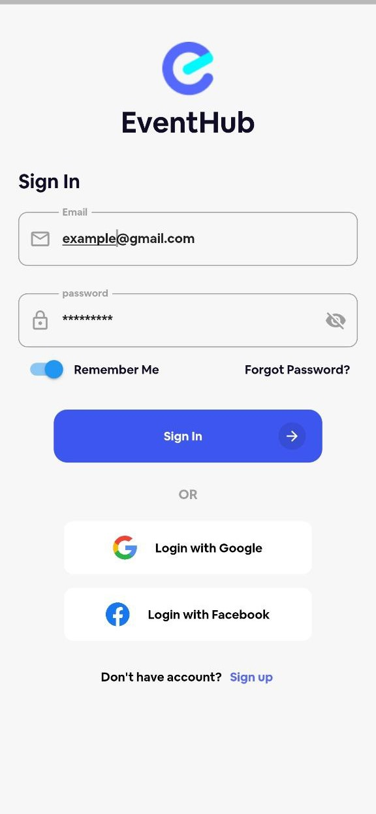

<p align="center">
  
</p>

# Event Booking App

## Content
 - [Description](#description)
 - [Features](#features)
 - [Tools](#tools)
 - [Screenshots](#screenshots)
 - [APK Path ](#apk-path )


# Description

Welcome to the Event Booking App! This mobile application allows users to easily browse, book, and manage event tickets. The app is built using Flutter and Dart, with BLoC state management to handle the app's state efficiently.


## Features

- Event Listings: Browse a curated list of upcoming events.
- Event Details: View detailed information about each event, including date, time, location, and description.
- Ticket Booking: Book tickets directly through the app with a seamless checkout process.
- Booking History: Track your past bookings and view ticket details.
- User Authentication: Sign up and log in using email and password.
- Search Functionality: Search for events by name, category, or location.
- Favorites: Save events to your favorites for quick access later.


## Tools


# Screenshots

<p align="center">
  
  
</p>

<p align="center">
  
  
</p>

<p align="center">
  
  
</p>

<p align="center">
  
  
</p>


<p align="center">
  
  
</p>
<p align="center">
  
  
</p>
<p align="center">
  
</p>


## Deployment

To deploy this project run this command in terminal

```bash
 flutter build apk
```

## APK Path 
build/app/outputs/flutter-apk/app-release.apk
